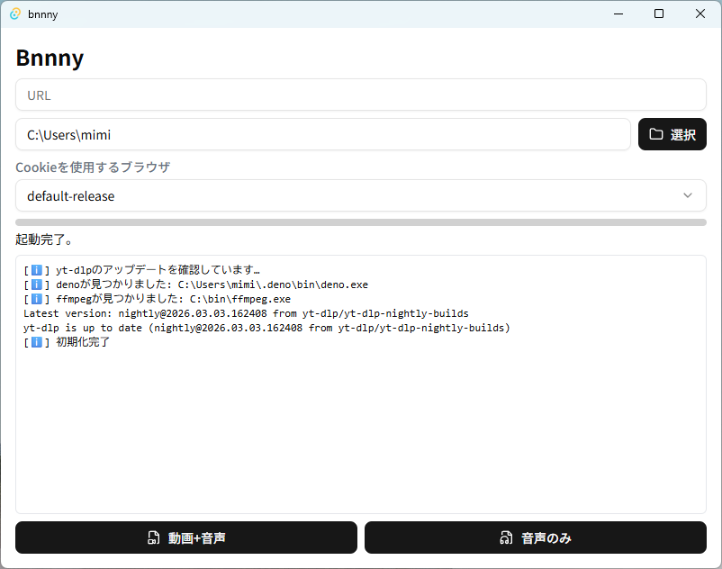

# bnnny



## About

bnnny は **yt-dlp の GUI フロントエンド**です。
yt-dlp は通常コマンドラインで使用しますが、bnnny を使うことで **URLを入力するだけで動画をダウンロード**できます。

このソフトは「簡単に使えること」を目的に開発されており、設定項目をできるだけ少なくしてすぐ使えるように設計されています。

---

# 機能

## ブラウザプロファイルの自動取得

Firefox / Floorp / Zen Browser のプロファイルを自動で取得できます。

取得したプロファイルは **Cookieの読み込み**に利用できます。これにより、以下のような動画にも対応できます。

* ログインが必要な動画
* 年齢制限のある動画

---

## URLによるオプションの自動選択

入力されたURLを解析し、サイトに応じて自動的にオプションを設定します。

### 共通

* サムネイルの埋め込み
* メタデータの追加

---

### YouTube

**プレイリストの場合**

保存形式

```
%(playlist_title)s/%(title)s.%(ext)s
```

例

```
MyPlaylist/video.mp4
```

**単体動画の場合**

```
%(title)s.%(ext)s
```

---

### YouTube Music

**共通設定**

* サムネイルを 1:1 の正方形にクロップ

**プレイリストの場合**

```
%(album)s/%(playlist_index)02d - %(title)s.%(ext)s
```

例

```
Album/01 - Song.mp3
```

**単体曲の場合**

```
%(title)s.%(ext)s
```

---

# 対応サイト

現在主に対応しているサイト

* YouTube
* YouTube Music

その他のサイトでは正常に動作しない場合があります。

---

# 依存関係

bnnny を動作させるためには、以下のソフトウェアが必要です。

## ffmpeg

動画や音声の処理に使用されるツールです。
主に次の用途で使用されます。

* 動画と音声の結合
* 動画や音声の変換
* サムネイルの埋め込み

### インストール例

Linux

```
sudo apt install ffmpeg
```

macOS

```
brew install ffmpeg
```

Windows

```
winget install ffmpeg
```

---

## deno

JavaScript / TypeScript を実行するためのランタイムです。

bnnny では、サイト側のチャレンジ（ボット対策など）を処理するために使用します。

### インストール

公式サイト

[https://deno.com](https://deno.com)

または

```
curl -fsSL https://deno.land/install.sh | sh
```

---

# 開発環境

開発に使用している環境です。

## Windows

* Windows 11 Pro
* Visual Studio Code

## macOS

* MacBook Air (2020, M1)
* macOS 15.7.4
